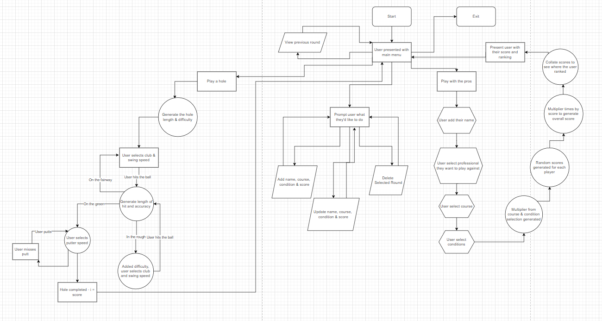
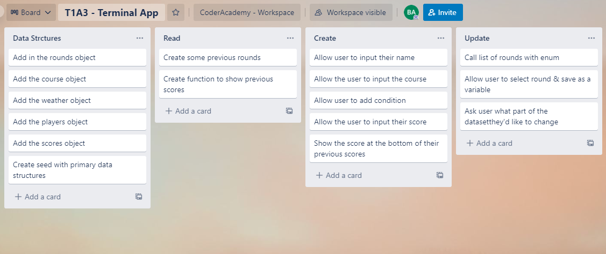
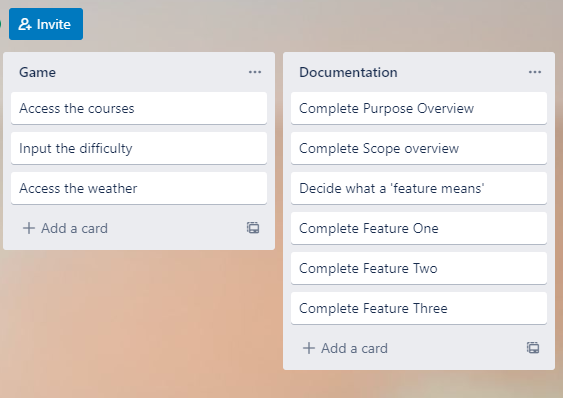
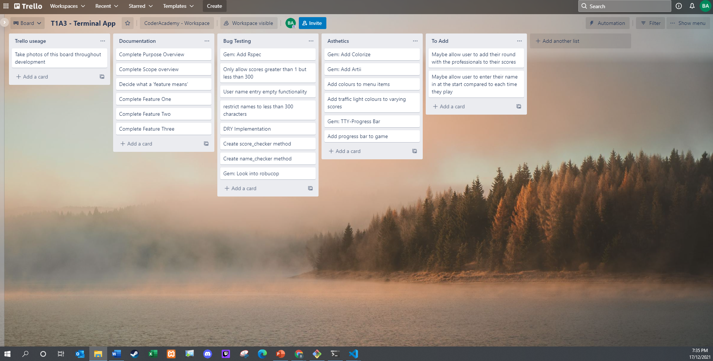

# **Software Development Plan**

## **Vital Links**
[Github Repo](https://github.com/Btallan/T1A3---CaddyMate) 
[Trello Board](https://trello.com/invite/b/7lEyGUmX/53e0e60dd149034f9fe8b89d8a7362c4/t1a3-terminal-app)

## ***Purpose***
Describe at a high level what the application will do,
Identify the problem it will solve and explain why you are developing it,
Identify the target audience,

CaddyMate, is a terminal application that will allow golfers to; diarise their previous scores, look over their previous games, to update their previous scores and delete any scores! The terminal will also have the ability for user to play a game with the professionals and see how their score stack up against them! 

The problem identified is the record keeping of previous games, which can then be used for tracking over time, to see how their score is improving. Developing this application will allow myself to track my previous games, without having to go through old score cards, which also take up space!

> The target audience essentially is those whom play rounds of golf, and want to keep tract of their scores. 

The target audience that has been identified essentially is golfers, who play rounds of the course, such as 9 or 18 holes, and want to manage this information better.

## ***Scope***
Explain how a member of the target audience will use it

> Golfers will be able to enter in the rounds they have played, which will include; their score, course name, and holes played (9 or 18).

Users will also be able to play against the professionals, they will be able to select; the course (for difficulty), the conditions (fine, windy, morning dew), handicap (low, medium, high). These inputs will create a multiplier that is then applied to the randomised scores (which are between 65-78). The user will play against three other players, whom are randomised from a pool. The system will randomise four score then apply them to each player, thus creating a score for each at the course.

The key data points which make up a golfers score include; score, course, holes played and course conditions.

CaddyMate, is a terminal application that will allow golfers to; diarise their previous scores (and relevant information), look over their previous games to see how they’re improving, to update their previous scores if need be and delete any scores which they don’t want to remember! The terminal will also have the ability for user to play a game with the professionals and see how their score stack up against them! 

## Features
### Play with the pros!
Internally there is a game called ‘Play the Pros’. Users can access the game through the main menu.

They will be able to select two professionals from the list they wish to play against, such as Adam Scott or Jack Nicklaus. Users will also be able to select the course from a list they wish to play on, as well as the conditions.

The course and condition have their own difficulty multiplier which will then be averaged. Scores are randomly generated, with the multiplier then applied resulting in the final score.

### Track Rounds
Users will be able to add a round to the dataset. They can add; the course, conditions and score. This is then stored in an array of rounds (previous games), which can then be accessed at a later stage.

### Edit Previous Rounds
Users will also be able to edit the data points of their previous matches such as; name, course, condition and score. This can occur singular for each dataset or the whole set combined.

## Requirements & Installation
### Requirements
- A computer,
- An internet connection,
- A github account (optional)

### Dependencies 
- A computer which can run ruby programs,

### Installation
- Pull from GitHub,
- In CLI install bundler using `gem install bundler`
- To install dependant gems run `bundle install`
- In desired CLI targeted at cloned folder run `ruby golf.rb`

## Error Handling

## Control Flow Diagram

## Trello board progression
### 16-12-21

### 17-12-21

